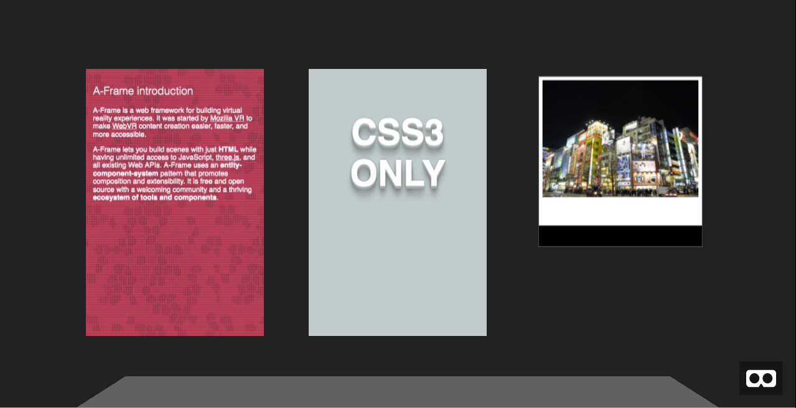

# aframe-html-source

An A-Frame component to display HTML inside an `<a-image>` primitive.



## Inspiration

This component is inspired by the articles [DOM2Texture: Abusing Arcane APIs](http://dassur.ma/things/dom2texture/) and [Drawing DOM objects into a canvas](https://developer.mozilla.org/en-US/docs/Web/API/Canvas_API/Drawing_DOM_objects_into_a_canvas).

## Install

Simply [grab the source](https://rawgit.com/delapuente/aframe-html-source/master/src/aframe-html-source.js) or import from the Internet:

```html
<head>
  <script src="https://aframe.io/releases/0.5.0/aframe.min.js"></script>
  <script src="https://rawgit.com/delapuente/aframe-html-source/master/src/aframe-html-source.js"></script>
</head>
```

## Usage

```html
<body>
  <a-scene>
    <a-image html-src="#test" position="0 1.6 -1"></a-image>
  </a-scene>

  <section id="test">
    <p>
      A-Frame is a web framework for building virtual reality experiences. It
      was started by <a href="https://mozvr.com" target="_blank"
      rel="external">Mozilla VR</a> to make <a href="https://iswebvrready.com"
      target="_blank" rel="external">WebVR</a> content creation easier,
      faster, and more accessible.
    </p>
  </section>
</body>
```

## Limitations

* No interactivity (so no links either)
* No live updates (sorry, not animated GIFs)
* Not rendering cross origin resources
* No videos
